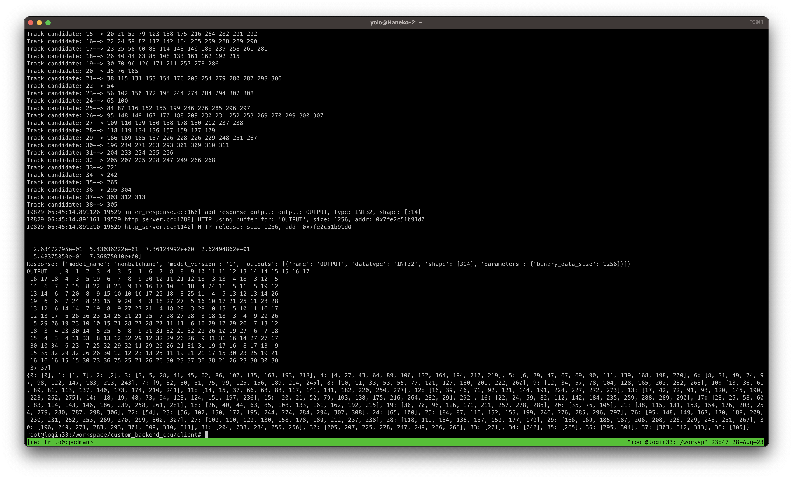
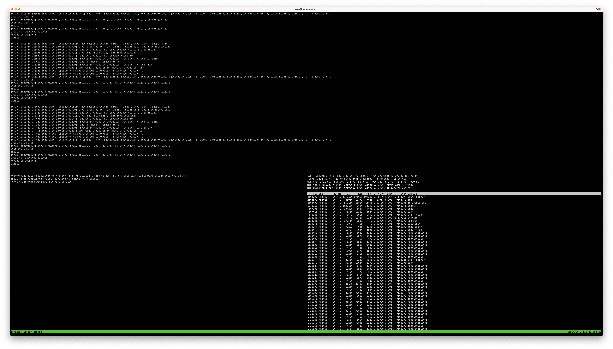

# Build docker customized backend based on tritonserver:22.02-py3

## How to Run
```bash
podman-hpc build -t hrzhao/custom_backend:v0.6 -< docker/Dockerfile
podman-hpc pull hrzhao076/custom_backend:1.0 # pull from dockerhub, this 1.0 version is built from the above dockerfile 

```

### Start the Triton server 
```bash 
cd <path-to-exatrkx-service>
# cd /global/cfs/projectdirs/atlas/hrzhao/ExaTrk/exatrkx-service 

podman-hpc run -it --rm --gpu --shm-size=2g -p8000:8000 -p8001:8001 -p8002:8002 -v ${PWD}:/workspace/ hrzhao/custom_backend:v0.6
podman-hpc run -it --rm --ipc=host --net=host --ulimit memlock=-1 --ulimit stack=67108864 -v ${PWD}:/workspace/ docker.io/hrzhao076/custom_backend:1.0

podman-hpc run -it --rm --net=host -v ${PWD}:/workspace/ docker.io/hrzhao076/custom_backend:1.0

mkdir -p /workspace/custom_backend_cpu/backend_2/build
cd /workspace/custom_backend_cpu/backend_2/build
rm -rf * && cmake -DCMAKE_INSTALL_PREFIX:PATH=`pwd`/install ../  -DCMAKE_PREFIX_PATH="$(python -c 'import torch;print(torch.utils.cmake_prefix_path)')" && make install -j20 

cp -r install/backends/exatrkxcpu/ /opt/tritonserver/backends && tritonserver --model-repository=/workspace/custom_backend_cpu/model_repo/ --log-verbose=4

```
### Start the client 
```bash
cd <path-to-exatrkx-service>
#cd /global/cfs/projectdirs/atlas/hrzhao/ExaTrk/exatrkx-service 

podman-hpc run -it --rm --net=host -v ${PWD}:/workspace/ nvcr.io/nvidia/tritonserver:23.07-py3-sdk bash
pip install pandas

# send the request to the server from client 
cd /workspace/custom_backend_cpu/client
python extrkcpu_client.py

# CPU version of client 
./inference-aas -d /workspace/exatrkx_pipeline/datanmodels/lrt/inputs/ -t 1 -u localhost:8001

# CPU version of ExaTrkX 
./inference-cpu -d /workspace/exatrkx_pipeline/datanmodels/lrt/inputs/ -m /workspace/exatrkx_pipeline/datanmodels
## One event test case 
./bin/inference-cpu -m /workspace/exatrkx_pipeline/datanmodels -d /workspace/exatrkx_pipeline/datanmodels/in_e1000.csv

```

### Results 


This also shows multi-core is runnig with server-client mode.   

## TODO:
- [x] Fix the shape issue of 2nd inference 
- [x] Move initialization variables to constructor
  - [ ] public or private? 
- [ ] Some configs are hard coded in the code, need to be able to read from `config.pbtxt`  
- [ ] Set the ouput type to read from `config.pbtxt`
- [ ] Need to run in scratch space, instead of project 
- [ ] Add batch support, may need ragged batching [ragged_batching](https://docs.nvidia.com/deeplearning/triton-inference-server/user-guide/docs/user_guide/ragged_batching.html) 
- [ ] How to make use of collector?  
- [ ] Backend 1: compile `libExaTrkx.so` as a static library and link it to the backend 


# DeV Notes...

```bash
podman-hpc run -it --rm --ipc=host --net=host --ulimit memlock=-1 --ulimit stack=67108864 -v ${PWD}:/workspace/ hrzhao/test_triton:v0.1


```

## Useful commands:
``` bash
rm -rf * && cmake -DCMAKE_INSTALL_PREFIX:PATH=`pwd`/install ../ && make install -j20

rm -rf * && cmake -DCMAKE_INSTALL_PREFIX:PATH=`pwd`/install ../  -DCMAKE_PREFIX_PATH="$(python -c 'import torch;print(torch.utils.cmake_prefix_path)')" && make install -j20  && cp -r install/backends/exatrkxcpu/ /opt/tritonserver/backends && tritonserver --model-repository=/workspace/custom_backend_cpu/model_repo/ --log-verbose=4

```

## Naming Convention 
`ExatrkxCPU` and `ExatrkXCPU`

## CXX11_ABI
```
python -c "import torch; print(torch._C._GLIBCXX_USE_CXX11_ABI)"
```

# tutorial: recommended backend 
```bash
cd /workspace/custom_backend_cpu
cd examples/backends/recommended/build 

cmake -DCMAKE_INSTALL_PREFIX:PATH=`pwd`/install -DTRITON_BACKEND_REPO_TAG=r22.02 -DTRITON_CORE_REPO_TAG=r22.02 -DTRITON_COMMON_REPO_TAG=r22.02 ../

make install -j8 

cp -r install/backends/recommended/ /opt/tritonserver/backends/

cd /workspace/custom_backend_cpu/
tritonserver --model-repository=/workspace/custom_backend_cpu/examples/model_repos/recommended_models/
```

```bash
podman-hpc run -it --rm --net=host -v ${PWD}:/workspace/ nvcr.io/nvidia/tritonserver:23.07-py3-sdk bash

cd custom_backend_cpu/examples/
python clients/recommended_client
```

## work on mod recommended backend 

``` bash
rm -rf * && cmake -DCMAKE_INSTALL_PREFIX:PATH=`pwd`/install ../ && make install -j20 && cp -r install/backends/recommended/ /opt/tritonserver/backends/ && \
tritonserver --model-repository=/workspace/custom_backend_cpu/examples/model_repos/recommended_models_mod --log-verbose=4
```

Note: collector is used in the recommended backend, which means input_buffer is a 1-d array that batched input is stored in a continuous way. 
It is said to be parallelized.


## Example backends 
[PyTorch Backend](https://github.com/triton-inference-server/pytorch_backend)   
[Python Backend](https://github.com/triton-inference-server/python_backend)


# Dev 

