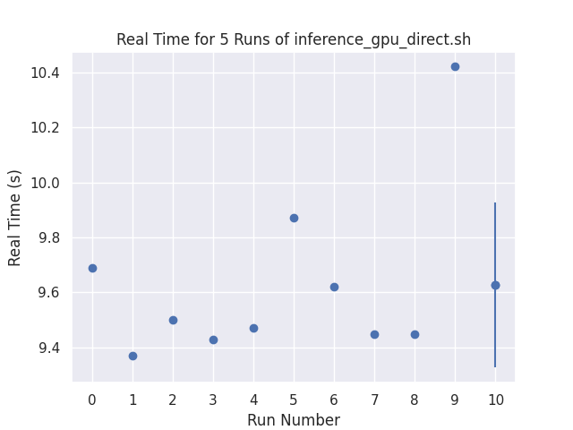
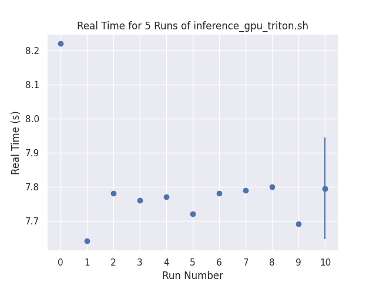
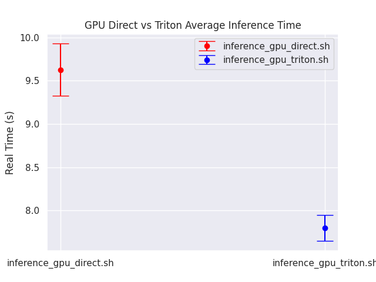

# Evluate the Time performance 

A docker image is provided for the evaluation where the triton backend is compiled and installed, as well as the cpp version triton client `inference-aas`. 
```bash
podman-hpc pull hrzhao076/exatrkx_triton_backend:1.0 
```

The Dockerfile is in the top directory because the source codes are needed. 

```bash
cd <exatrkx>
podman-hpc build -t $(whoami)/exatrkx_triton_backend:1.0 -f Dockerfile 
```


```bash 
podman-hpc run -it --rm --gpu --shm-size=20g -p8000:8000 -p8001:8001 -p8002:8002 -v ${PWD}:/workspace hrzhao076/exatrkx_triton_backend:1.0 

tritonserver --model-repository=/opt/model_repos
```

```bash 
podman-hpc run -it --rm --gpu --ipc=host --net=host --ulimit memlock=-1 --ulimit stack=67108864 -v ${PWD}:/workspace/ hrzhao076/exatrkx_triton_backend:1.0

cd /workspace/evaluate/
python evaluate_time.py 

# if you want to use more events(5000), use the following command
# python evaluate_time.py --use-more 

```

## Example results 
The following results are obtained on a nersc compute node with 1 GPU. The time measurement is by using the shell command `time` and the `real time` is used to compare.    




# Developer Notes
## perf_analyzer

``` bash 
perf_analyzer -m exatrkxgpu --percentile=95 -i grpc --shape FEATURES:100,3
```

```
inference-gpu -m /workspace/exatrkx_pipeline/datanmodels/ -d /workspace/exatrkx_pipeline/datanmodels/in_e1000.csv

inference-aas -m exatrkxgpu -d /workspace/exatrkx_pipeline/datanmodels/in_e1000.csv
```

```bash
tritonserver --model-repository=/workspace/custom_backend_gpu/model_repo/ --log-verbose=4
```